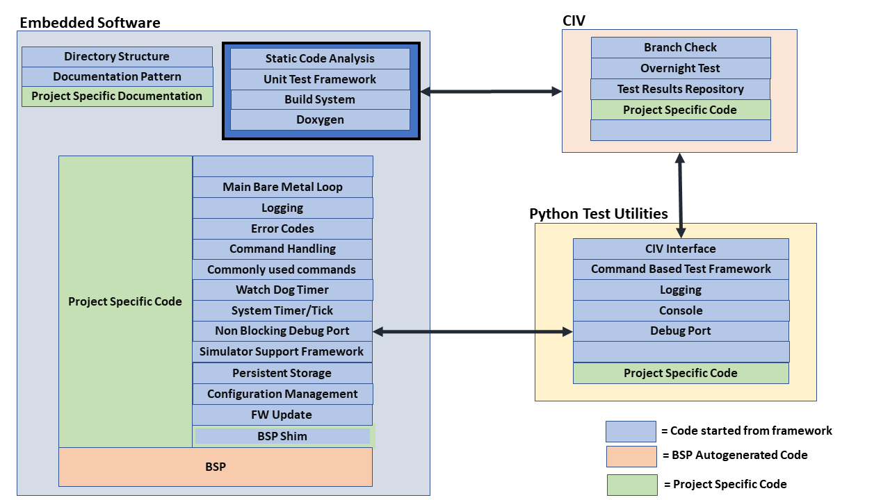
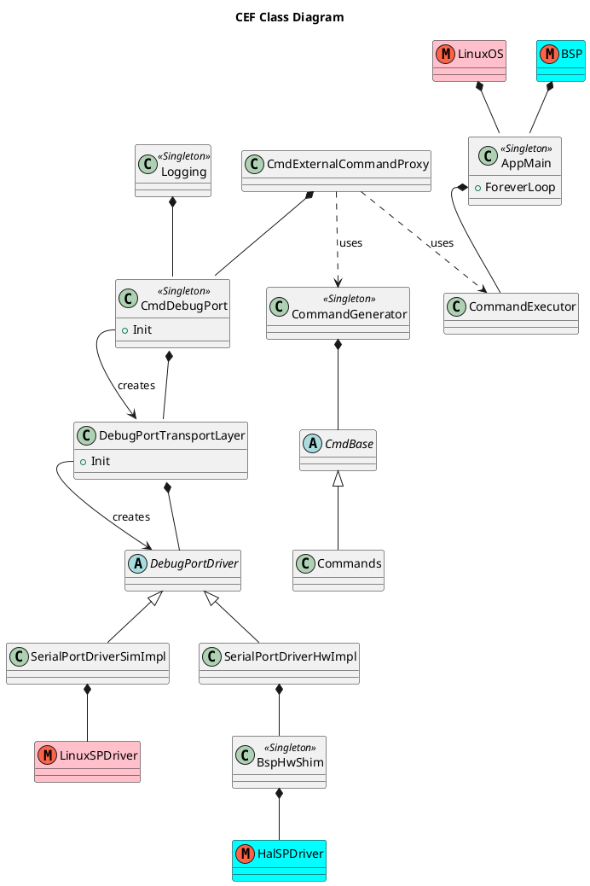
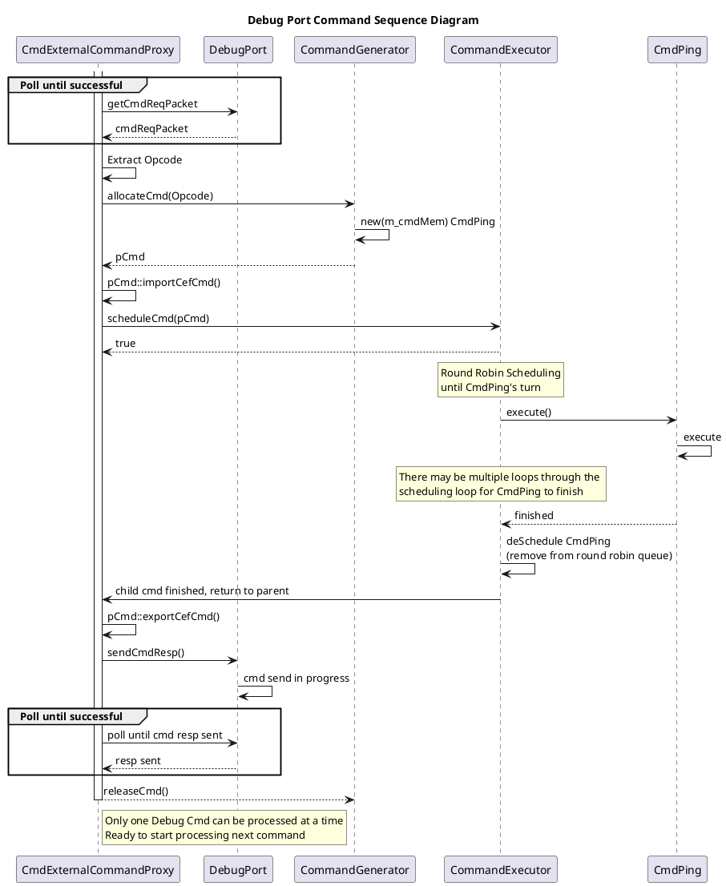

# Common Engineering Framework Architecture

The Common Engineering Framework (CEF) is intended to be:

* Simple and easy to learn, yet serves as a "starting point" for most embedded engineering projects of ~1 year or less
* Extendable and expandable
* Simple and easy to learn
* The base configuration should consume very little microcontroller resources (memory footprint, processor time, and gpio resources)

### Key Components

Below is an overview of the Common Engineering Framework key components

**Note the legend in the diagram to help illustrate what aspects of a design are provided by the framework, and where customer specific work needs to be included.**

The framework is designed to have replaceable components, as well as to be extended.  For example, the "Non Blocking Debug Port" could be implemented as a Serial Port, USB, Ethernet, or whatever other protocol that the user application may require.  Adding an RTOS can extend the framework to support a non-blocking driver.

The python component is intended to offload debug functionality from the embedded software to reduce code space, facilitate faster development and more robust testing.  For example, no strings are stored in the embedded software image; there is a system is place such that python knows which "log" or "print" is intended for the console, and formats the "logging packet" appropriately before displaying it to the logging console.

CIV (Continuous Integration and Verification) supports executing a Pytest framework as part of either a "branch check" or a "merge request".  As python can execute most commands in the embedded software via a proxy system, powerful test suites can be built up to validate the systems performance.

### Architecture

The following class diagram below describes the overall architecture for the CEF.  CEF-simulator-specific classes or modules appear in red, HW-specific in light blue, and common classes and modules appear in light yellow.  This helps to illustrate that the bulk of the CEF code is common to both the simulator and the HW build.  This diagram is followed by sections that detail the classes and interactions between them.

#### Component Descriptions

##### AppMain

The AppMain object is instantiated within either the Linux OS or the Microcontroller BSP auto-generated code.  The AppMain is intended to provide CEF and User Application specific "main" functionality to parallel the BSP generated startup code.

##### CommandExecutor

On the simulator, the CEF runs as a single thread within a Linux executable.  On the HW, the CEF also runs within a single thread, in the Xilinx standalone OS.  In both cases, the AppMain object acts as a lightweight, round robin scheduler that avoids multiple threads or preemption in accordance with the architecture goals.  Commands are added to the executable list to be executed.

Commands have the following attributes:

* Are state machines that complete a given work task
* Run until reach a pend point (yields, and polls/checks for work on next entry into the state machine), or complete the work requested of the command.
* Next time the command is invoked, it picks up where it left off
* Some commands run forever, others complete after several iterations of the loop, and other may complete right away.
* Execute for a short period of time, and then return control to the CommandExecutor

The watch dog timer is reset after each command finishes executing.

##### Command Generator

A data store that allocates/instantiates commands.  Commands can be created

* At system startup.  These commands likely run "forever"
* By other commands.  There is likely one or more "forever" commands that control the overall work of the system.  These forever commands spawn "child" commands to do work to complete their tasks.
* By Python, via a proxy command system (CmdExternalCommandProxy).

##### CmdExternalCommandProxy

Via the DebugPort, the python can invoke most commands in the system.  This provides a powerful system to extensively test fuctionality of the system.

##### Logging

The logging system provides a way to do "printf" style debug/status.  To save code space, a system is put in place such that the strings are generated by the python system.  Logging shares the same DebugPort as the Proxy Command Handler in order to minimize CEF's microcontroller resource useage (as well as to minimize number of debug pins needed on customer's board).  

##### Debug Port

intended to be replaceable...extendable... initial implementation is simple serial port implementation (no ack/nack), but can easily be extended to most advanced serial or other interfaces
