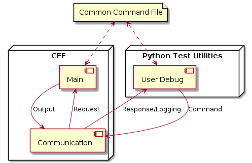
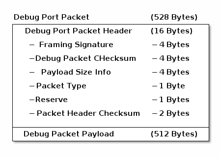

# Debug Port

### Debug Communication

Below is an overview of debug communication between Python Test Utilities and CEF.  Communication will consist of commands requests, command responses, and logging data.  Only one command request can be processed at a time.  Both the CEF and Python Test Utilities will have a common command document library to build and interpret commands requests and responses.  Communication will only be sent once, if it is not received the sender will not be aware of this and there will be no retries.  This decision was made to speed up development and retries can be implemented later if projects need this feature.

##### Python Test Utilities - User Debug

The python test utilities provide the user debug console.  In this console the user can send command requests, receive commands responses, and logging information.  CEF can only accept one command at a time.  Any command request the console user sends while CEF is processing prior command will be “lost”.

##### CEF/Communication Layer

The communication layers job is to handle all incoming and outgoing communication with Python Test Utilities.  It will send, logging data, command responses, and receive command requests.  It is also responsible for constructing and deconstructing packet header and checksum.

* Receive
  
  * CEF only fulfills one command request at a time.  When CEF is not in currently fulfilling a command request CEF communication layer must enable receiving to be able receive next command request from console user debug.  Receiving will be done on interrupts in order to stay non-blocking.
  * CEF command layer is responsible for decoding the debug port packet.  AppMain() responsibile to poll the Router, which in turn polls the Transport in order to see if a command has been recieved.
* Transmit
  
  * CEF can transmit both command response and Logging information.  Command responses will take priority over logging if both are ready at the same time.  The packet for each will be the same with a different 8-bit debug packet type.
  * CEF Transport layer is responsible for packaging debug port packet header, data packet, and checksum.
  * The data will be transmitted on interrupts in order to stay non-blocking.

##### CEF Main

CEF main is responsible for allocating memory for the communication layer to send and receive packets, and packet headers.  CEF system is the “owner” of this memory.  Main is responsible for handling all commands and generating the command responses.  The main layer is also responsible for polling the communication layer to see status of command requests and command responses.

* For the first pass of this project the communication layer will copy all communication payload and header info to its own 528 bytes of memory to make development go faster.  This must be designed in a way where it will be easy to fix this resource insufficiency.

### Debug Packet

Debug Port Packets (528 bytes) – The debug port packet is the communication between CEF and the user debug console.  The packet consists of header info, payload, and checksum.  Only one command request can be handled at a time.  Once a command request is received the debug port will drop any data received by the user until it fills the command request or times out.

##### Debug Header Packet

Debug header packet is 16 bytes to indicate the following.

* Framing Signature - 4 bytes
* Payload Checksum - 4 bytes
* Number of Bytes in Payload - 4 bytes
* Debug type (logging, CEF command request, CEF command response) - 1 byte
* Reserve - 1 byte
* Header Checksum - 2 bytes

##### Debug Payload Packet

Debug payload is a maximum of 512 bytes.  Command request and response will be “decoded” by a “shared” command file between CEF system and user debug.  This will help limit the amount of data that needs to be sent.

