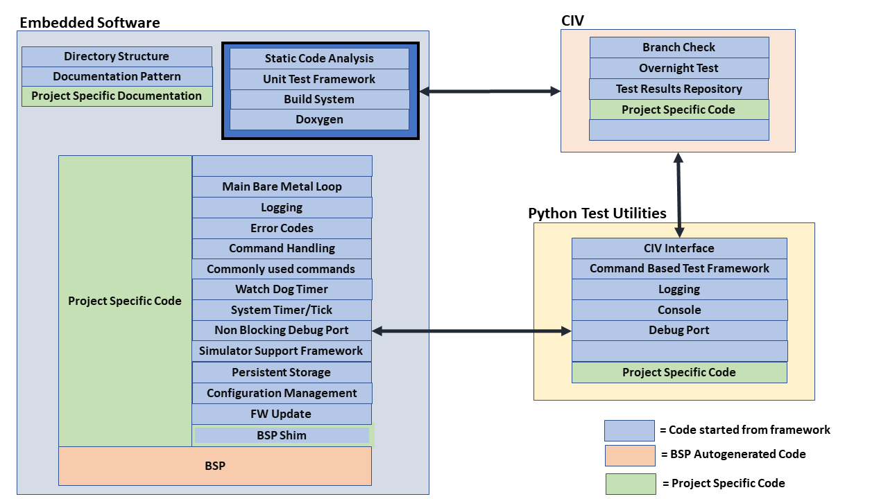
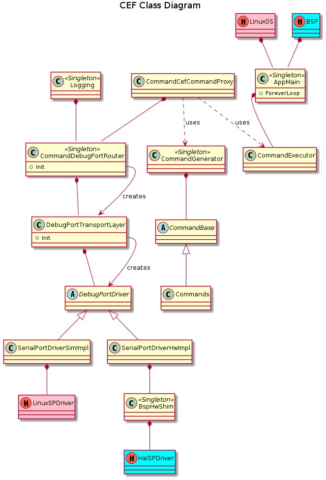
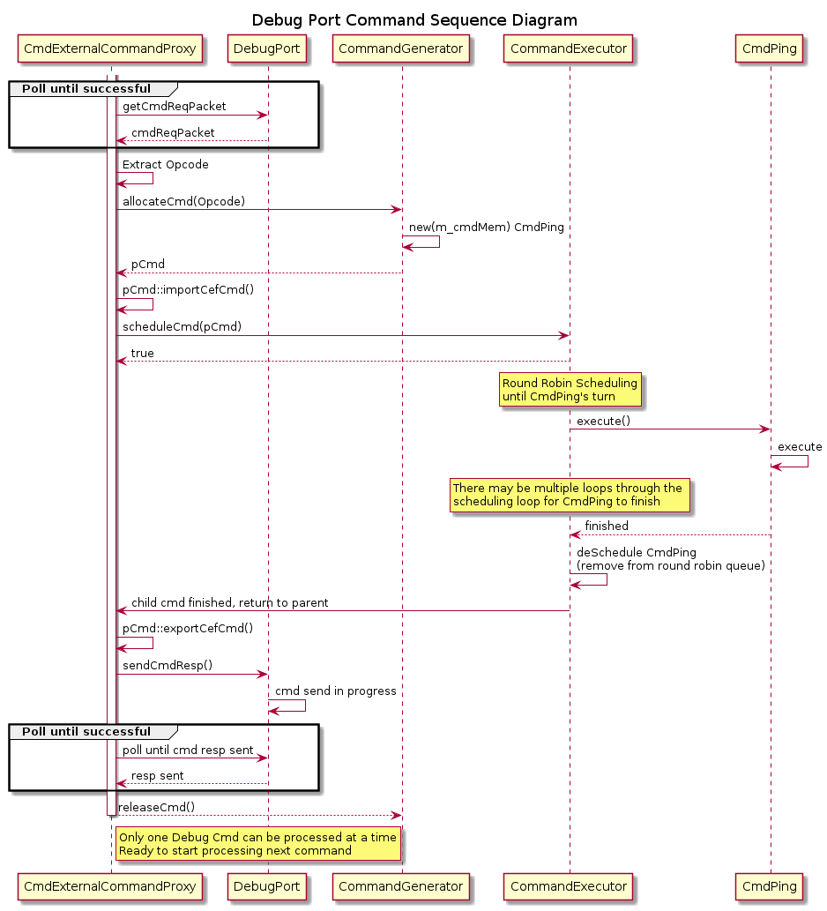

# Common Embedded Framework Architecture

The Common Engineering Framework (CEF) is intended to be:

* Simple and easy to learn, yet still be capable of serving as a "starting point" for most embedded engineering projects of ~1 year or less
* Extendable and expandable
* The base configuration should consume very little microcontroller resources (memory footprint, processor time, and gpio resources)

### Key Components

Below is an overview of the Common Engineering Framework key components

**Note the legend in the diagram to help illustrate what aspects of a design are provided by the framework, and where customer specific work needs to be included.**

The framework is designed to have replaceable components, as well as to be extended.  For example, the "Non Blocking Debug Port" could be implemented as a Serial Port, USB, Ethernet, or whatever other protocol that the user application may require.  Adding an RTOS can extend the framework to support a non-blocking driver.

The python component is intended to offload debug functionality from the embedded software to reduce code space, facilitate faster development and more robust testing.  For example, no strings are stored in the embedded software image; there is a system is place such that python knows which "log" or "print" is intended for the console, and formats the "logging packet" appropriately before displaying it to the logging console.

CIV (Continuous Integration and Verification) supports executing a Pytest framework as part of either a "branch check" or a "merge request".  As python can execute most commands in the embedded software via a proxy system, powerful test suites can be built up to validate the systems performance.

### Architecture

The following class diagram below describes the overall architecture for the CEF.  CEF-simulator-specific classes or modules appear in red, HW-specific in light blue, and common classes and modules appear in light yellow.  This helps to illustrate that the bulk of the CEF code is common to both the simulator and the HW build.  This diagram is followed by sections that detail the classes and interactions between them.

#### Component Descriptions

##### AppMain

The AppMain object is instantiated within either the Linux OS or the microcontroller BSP auto-generated code.  The AppMain is intended to provide CEF and user application specific "main()" functionality to parallel the BSP generated startup code.

##### CommandExecutor

On the simulator, the CEF runs as a single thread within a Linux executable.  On the HW, the CEF also runs within a single thread within the bare metal super loop.  In both cases, the AppMain object acts as a lightweight, round robin scheduler that avoids multiple threads or preemption in accordance with the architecture goals.  Commands are added to the executable list to be executed.

Commands have the following attributes:

* Are state machines that complete a given work task
* Run until reach a pend point (yields, and polls/checks for work on next entry into the state machine), or complete the work requested of the command.
* Next time the command is invoked, it picks up where it left off
* Some commands run forever, others commands complete after several iterations of the loop, and some commands may complete right away.
* Execute for a short period of time, and then return control to the CommandExecutor (i.e. no command is permitted to block/pend).

The watch dog timer is reset after each command finishes it turn  executing, and before the CommandExecutor starts the next command.

##### Command Generator

A data store that allocates/instantiates commands.  Commands can be created

* At system startup.  These commands likely run "forever"
* By other commands.  There is likely one or more "forever" commands that control the overall work of the system.  These forever commands spawn "child" commands to do work to complete their tasks.
* By Python, via a proxy command system (CmdExternalCommandProxy).

##### CmdExternalCommandProxy

Via the DebugPort, python can invoke most commands in the system.  This provides a powerful system to extensively test functionality of the system.  As shown in the sequence diagram below, the integrated python / Embedded Software (ES) system behaves as follows.

1. Python sends a "CEF Request Command" to the ES via the debug port.  Only one CEF command can be outstanding at time.
2. The permanent command CmdExternalCommandProxy is polling the DebugPort for a CEF command.
3. Upon detection of a valid CEF command, the command's opcode is extracted from the CEF command and used to allocate a "child" command in the software via the CommandGenerator.  When a command (in this case CmdExternalCommandProxy) allocates  a command, it is called the "parent command" of the "child command" that it allocates.  The CommandGenerator manages the limited amount of internal memory to return a command object that correlates to the given opcode.
4. The cmd object is then populated appropriately with the information in the CEF Request command.
5. CmdExternalCommandProxy then schedules the command with the CommandExecutor
6. The CommandExecutor executes all active commands in a round robin fashion
7. When the command is finished executing, the command is de-scheduled from the CommandExecutor scheduling mechanism.  The CommandExecutor detects that the command was a child command, and returns the command to its  parent command (in this case CmdExternalCommandProxy)
8. CmdExternalCommandProxy exports the response field of the command to the "CEF Request Command" and sends the response back to python via the DebugPort.
9. Once CmdExternalCommandProxy receives acknowledgement that the CEF Command has been successfully sent to Python, the child command is released back to the CommandGenerator.  Waiting to release the child command until the CEF command has been successfully sent ensures that only one CEF command is active in the system at a time.

##### Logging

The logging system provides a way to do "printf" style debug/status.  To save code space, CEF provides the infrastructure  such that strings are not stored in the ES, and the python console generates the human readable output of the log.  Logging shares the same DebugPort as the Proxy Command Handler in order to minimize microcontroller resource usage (as well as to minimize number of debug pins needed on customer's board).

##### Debug Port

The DebugPort system has the following attributes:

* Packet based (rather than serial stream)
* Easily accommodates different physical layers (i.e. serial, USB, ethernet...)
* Initial serial implementation does not support ack/nack or retry
* Arbitrates among ES requestors for priority for transmit priority
