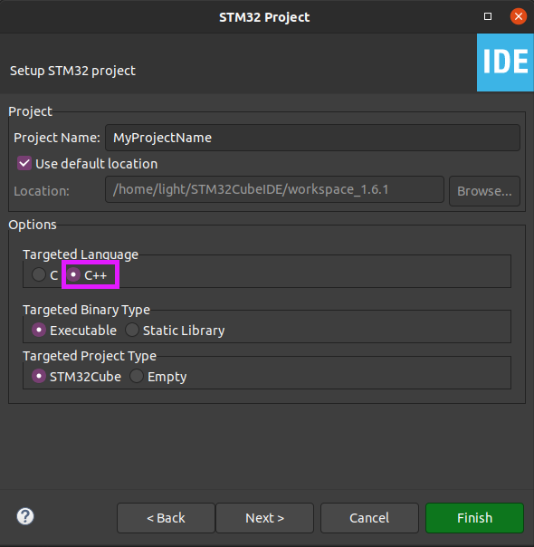
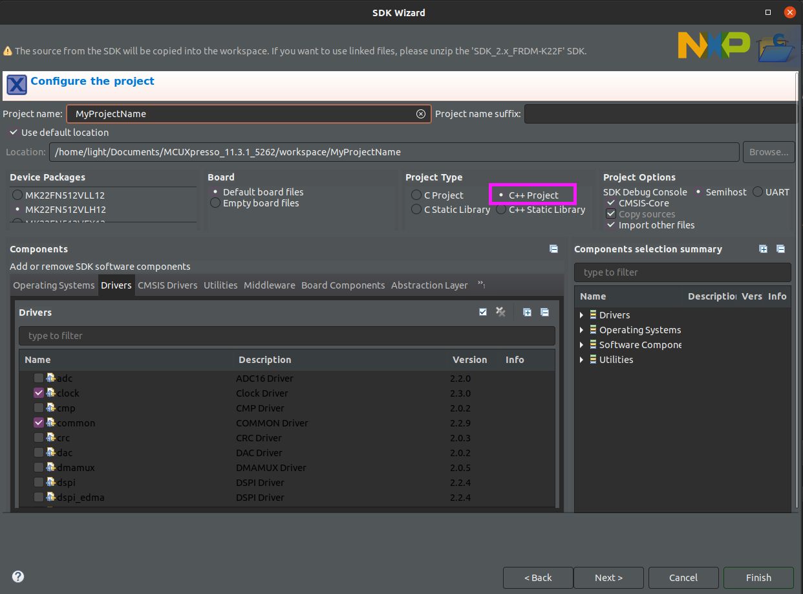
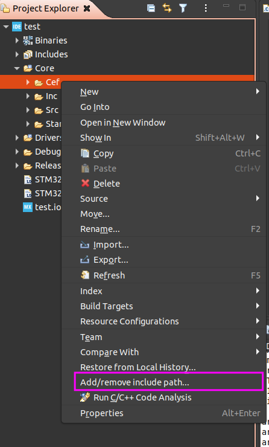
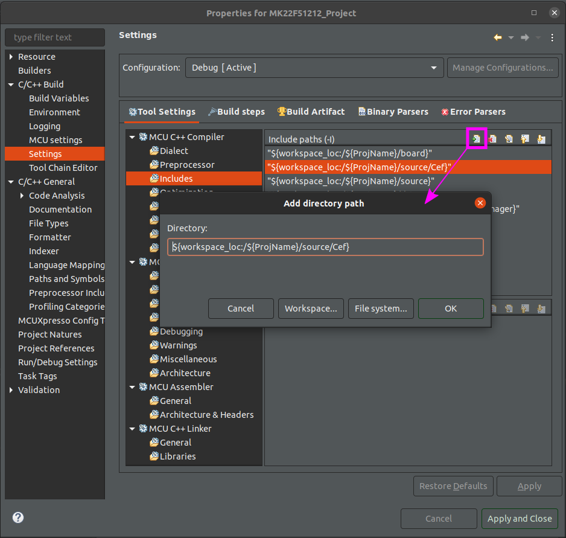

# Setting up your project

Currently build operations are handled by the vendor IDE for the microcontroller you are using for your project. These IDEs are pre-packaged with the necessary toolchains, allow for detailed peripheral and pin configuration, and handle automatic file generation for makefiles, linker scripts, assembly preprocessor instructions, etc. that match the MCU or development board chosen.

*NOTE*: The following instructions cover STMicro and NXP projects, but the instructions will be similar for other Eclipse-based IDEs

## STM32CubeIDE setup

When creating a new project, choose a new STM32 Project from the File->New menu. A new window will pop up for selecting a target. After doing so and clicking Next, a new popup will prompt for a project name. Within this window be sure to select C++ as the Targeted Language. Click Finish after this.



**NOTE: After the project has been created, rename the Core->Src->main.c to main.cpp.**

The MCU can now be customized with the Device Configurator within the IDE and the corresponding initialization code auto-generated. 

**NOTE: If you re-configure the device the IDE will put the auto-generated code in a new main.c file. You will have to reconcile this with your existing main.cpp file.**

## NXP setup

From File->New select New C/C++ Project, which will bring up a target selection window. After choosing a target and clicking Next, the next window prompts for a project name. Within this window be sure to select C++ Project under the Project Type pane.



After project creation the MCU's pins, peripherals, and clocks can be customized within the IDE and corresponding code auto-generated.

---
# Normal Syncroness project development - integrating CEF into a project

CEF is not used on its own, instead being pulled in to embedded projects as a module or library. For normal project work, simply clone the CEF repository locally and copy the resulting directory into your project's directory tree:
```
git clone http://bitbucket.syncroness.com:7990/scm/cef/cef.git
```

## Syncroness Internal CEF development - repository configuration

For actual CEF development, a target platform is desired for debug and test purposes - for this, the CEF repository is added to a parent repository as a submodule where CEF development can continue within an embedded context.

If you are setting up a new project from scratch the following commands will add CEF as a submodule and switch to a branch for further development. The commands should be executed from a top-level directory in the new project's repository/folder so that the submodule is added at an appropriate position in the directory tree. 

```
git submodule add cef http://bitbucket.syncroness.com:7990/scm/cef/cef.git Cef
git add .
git commit -m "adding submodule"
git push
cd Cef
git checkout  <cef_development_branch_name>
```

**Note: When creating branches in Jira, it is useful to create two branches (one for CEF and one for the target/Stm32/Nxp) and modify the branch name as an indication (example: feature/CEF-1-CEFSTM32-featuredescription and feature/CEF-1-CEFSw-featuredescription)**

If you are starting from an existing platform, the above steps should already have been performed and CEF is already set up as a submodule - you can confirm this by examining the presence and content of the '.gitmodules' file in the project, which should include a reference to the CEF repository. The following command will clone the project repository and the included CEF submodule:
```
git clone --recurse-submodules <container_repository_url> # Example: git clone --recure-submodules http://bitbucket.syncrones.com:7990/scm/cef/cefstm32.git
cd path/to/container
git checkout -b <container_project_work_branch> # This is the branch you've created for new work in your parent/container repository
cd path/to/submodule # Example: cd Core/Cef
git checkout -b <cef_development_branch_name> # This is the branch you've created for new work in the CEF repository
```

Once the submodule is set up, workflow is as follows: when committing changes to CEF, you should be within its subdirectory tree when performing git commands. Git will recognize that you are within the submodule instead of the parent/container project, and commits will go to the CEF repository (make sure you are on a branch, do not commit to CEF's origin/master). If you are making edits to the parent project you have set up, git commands can be performed anywhere within its directory above the submodule as normal. Note that these commits will not commit CEF changes to your project - you must continue to maintain two repository workflows when doing CEF development.

## Configuring builds

Once CEF is added to your embedded project it must also be added to the include paths for compiling and linking, along with subdirectories. Currently this must be done through the vendor IDE for your project, which auto-generates makefiles for build configurations.

### STM32

In STM32CubeIDE, right-click on the Cef directory in the Project Explorer's file tree and select "Add/remove include path". A window with both Debug and Release configurations selected will popup, select OK.



### NXP/McuXpresso

Right-click on the project itself in the Project Explorer pane and select Properties. Expand the C/C++ Build category and select Settings. Within the Tool Settings tab choose the MCU C++ Compiler->Includes selection and click the icon to add an include path, then enter the path to the CEF directory.


