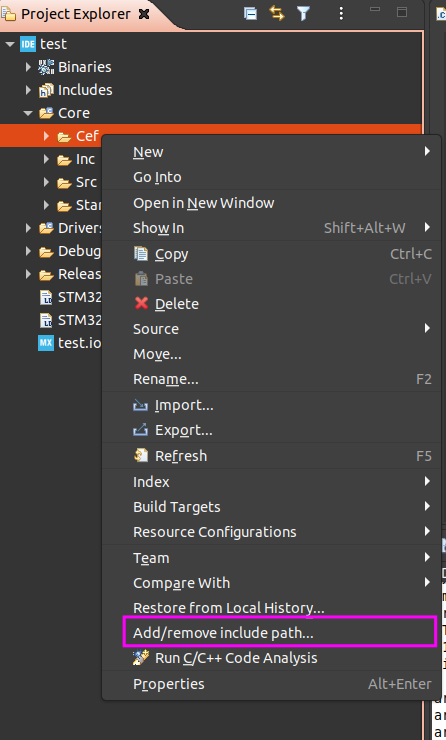
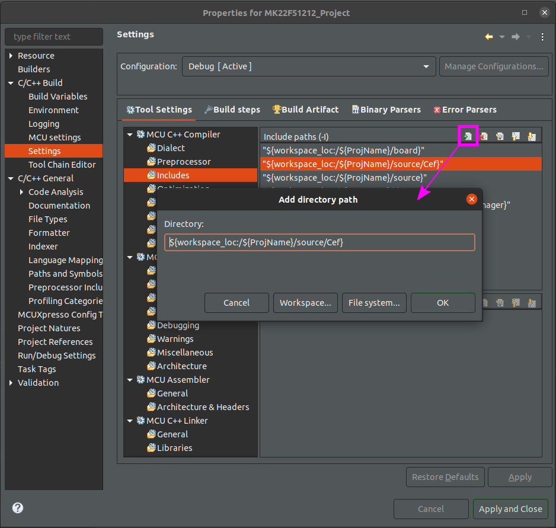

# Using CEF in your project

CEF is not used on its own, instead being pulled in to embedded projects as a module or library. To maintain some syncronization between the CEF repository and projects that use it, some additional git commands are used to maintain it as a subtree. This method pulls the CEF repository into the project under a subdirectory of the user's choosing. This results in a project with TWO remotes instead of the typical single remote: one for the project itself and one tracking the CEF repository. However, your project is still treated as a single repository. With typical git commands any changes made locally to the CEF source will only be pushed to your project repository, allowing for project-specific customizations to CEF.

## Repository setup

From within your project repository/folder, execute the following git commands:

```
git remote add cef http://bitbucket.syncroness.com:7990/scm/cef/cef.git
git fetch cef
git read-tree --prefix=Path/In/Project -u cef/master
```

### Getting upstream updates

When changes occur to the base CEF repository, such as bugfixes, they can be pulled into your project with the following:

```
git fetch cef
git merge -X subtree=Path/In/Project --squash cef/master
```

## Configuring builds

Once CEF is added to your embedded project it must also be added to the include paths for compiling and linking. Currently this must be done through the vendor IDE for your project, which auto-generates makefiles for build configurations.

### STM32

In STM32CubeIDE, right-click on the Cef directory in the Project Explorer's file tree and select "Add/remove include path". A window with both Debug and Release configurations selected will popup, select OK.



### NXP/McuXpresso

Right-click on the project itsel in the Project Explorer pane and select Properties. Expand the C/C++ Build category and select Settings. Within the Tool Settings tab choose the MCU C++ Compiler->Includes selection and click the icon to add an include path, then enter the path to the CEF directory.

