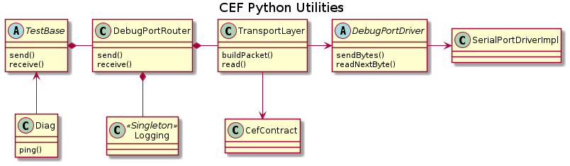

# CEF Python Utility

The CEF Python Utility is a set of tools with a command line interface for developing CEF projects. It includes functionality to send commands to the debug port and receive responses and logging messages. It also contains an extensible framework for creating test objects that interact with the CEF target. This can be used for debugging or creating unit/integration tests. It will also include functionality for interfacing with Continuous Integration for setting up routine testing and building. 

The Utility is run by executing a startup Python script with the '-i' option. This instantiates all necessary components and then leaves the Python interpreter running with them in memory for the user to interact with in a command-line environment.

## Debug Port Router

The Utility has a communications structure for talking to the CEF target's debug port and is responsible for routing packets based on their content, whether commands or logging messages. 

#### Logging

Logging messages received from the router are decoded by dictionary lookup. This saves space by storing long strings off the target. The logging object includes a file I/O handler to write messages to disk after decoding.

### Transport

Used by the DebugPort is an object for handling transport-layer logic including building outgoing packets and framing incoming ones. This also includes checksum calculation. Packet structure is defined by a contract file which includes definitions for packet types, known commands, and field sizes. This contract file is kept in sync with the CEF repository to maintain consistent packet schema between CEF and the Python Utility.

#### Framing

The transport layer includes a read loop on an independent thread that is constantly scanning incoming bytes. When header information is encountered then an expected number of data bytes is read followed by a checksum. Once the full frame is received and validated it is handed to the router based on packet type.

#### Checksum

The checksum is a simple error-detecting (but not error-correcting) scheme. All of the bytes of the packet's data, including header data, are summed and the resulting value is appended to the packet. After receipt and framing, the receiver performs the same calculation and compares it to the received checksum. If the values do not match then the frame is considered invalid.

### Driver

The next layer is a hardware abstraction layer for the port's driver, with methods for sending and receiving byte streams. This allows for different implementations of the physical layer (UART, ethernet, etc.)

## Test Framework

The Utility includes a test framework - a collection of objects which make use of the DebugPort to exercise different components of the target.

### TestBase

The framework includes an 'abstract' TestBase object from which the user will define derived classes for exercising different components/subsystems of the target project. The TestBase class has a DebugPortRouter as a member, equipping derived classes with target communication.

### Diag

Included in the Utility is a barebones diagnostics test object derived from TestBase. The Diag object contains a ping() method for testing DebugPort communicatons, which sends a command to the target and awaits a response within a timeout period. 

## Continuous Integration

**NOTE:** This is planned for future release

The Utility will include functionality to interact with the project's continuous integration setup to allow setting up automated unit testing, nightly and release builds, Doxygen generation, and other devops activites